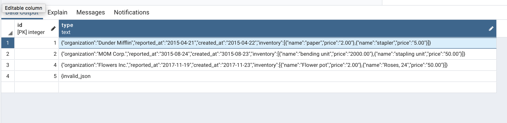

SuadeLabs Challenge
-------------------
This app purpose is to generate pdf/xml file from static data from postgres database.
The errors and the data is coming from separate service and is handled towards by app.py.

- report_id is a unique report id from the postgres database.
- type is goind to represent the type of the report_id from postgres. You can see one raw data snippet from the db below(out from 4)


```json
{"created_at":"2015-04-22","inventory":[{"name":"paper","price":"2.00"},{"name":"stapler","price":"5.00"}],"organization":"Dunder Mifflin","reported_at":"2015-04-21"}
```
Use this link for generating a pdf/xml out from the first row from the db (report_id = 1)

- http://127.0.0.1:5000/reports/1?format=pdf 
- http://127.0.0.1:5000/reports/1?format=xml


Attached we can find a screenshot with the table.




Usage and requirements
---------------------

- Python 3 installed on your machine

This project should follow the python PEP-8 conventions

For installing all the dependencies please run the following command:
- pip install  -r requirements.txt

For listing all the dependencies installed:
- pip list --local


